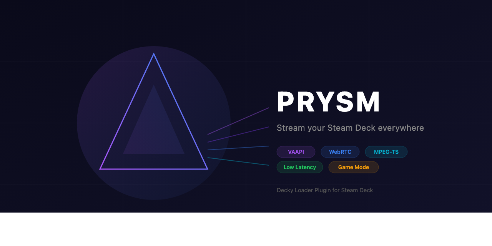

<p align="center">
  
</p>

<p align="center">
  <strong>Stream your Steam Deck screen to any browser.</strong><br>
  Hardware accelerated, one-tap start from Game Mode.
</p>

<p align="center">
  <a href="https://github.com/hostsrc/decky-prysm/releases"></a>
  <a href="https://github.com/hostsrc/decky-prysm/blob/main/LICENSE"></a>
  <a href="https://github.com/hostsrc/decky-prysm/actions"></a>
</p>

## How It Works

```
Steam Deck (Game Mode)
┌────────────────────────────────────────────────────────┐
│                                                        │
│  Gamescope → kmsgrab → FFmpeg (VAAPI H.264)            │
│                            │                           │
│                    ┌───────┴────────┐                  │
│                    │                │                  │
│              MPEG-TS HTTP      MediaMTX RTSP           │
│              (stream_server)   (WebRTC relay)          │
│                    │                │                  │
│                 :7770            :8889                  │
│                                                        │
│  Decky QAM: [Start Streaming] Quality Method           │
└────────────────────┬───────────────┬───────────────────┘
                     │               │
              ┌──────▼──────┐ ┌──────▼──────┐
              │ mpegts.js   │ │ WebRTC      │
              │ ~500ms      │ │ ~200ms      │
              │ Any browser │ │ Any browser │
              └─────────────┘ └─────────────┘
```

## Features

- **One-tap streaming** from Steam Deck QAM (Quick Access Menu)
- **Two streaming methods:**
  - **MPEG-TS** - stable, ~500ms latency, works everywhere
  - **WebRTC** - lower latency ~200ms via MediaMTX
- **VAAPI hardware encoding** - H.264 on AMD GPU, near-zero CPU usage
- **Quality presets** - 480p30, 720p30, 720p60, 1080p30, 1080p60
- **Live stats** - viewers, bytes sent, encoder status in QAM
- **Auto-restart** - recovers from capture failures
- **No Desktop Mode required** - works entirely in Game Mode

## Install

### From Decky Plugin Store
Search for **Prysm** in the Decky plugin store (coming soon).

### Manual Install (one-liner)
```bash
curl -sL https://raw.githubusercontent.com/hostsrc/decky-prysm/main/install.sh | bash
```

### From ZIP
Download `Prysm-v0.2.0.zip` from [Releases](https://github.com/hostsrc/decky-prysm/releases), extract to `~/homebrew/plugins/`, restart Decky.

## Usage

1. Open a game on your Steam Deck
2. Press **`...`** (QAM button)
3. Find **Prysm** in the plugin list
4. Choose **Method** (MPEG-TS or WebRTC) and **Quality**
5. Tap **Start Streaming**
6. Open the URL on any device on the same network

## Requirements

- **Steam Deck** running SteamOS 3.5+
- **Decky Loader** installed
- **FFmpeg** with VAAPI (pre-installed on SteamOS)
- Game must NOT have `ENABLE_GAMESCOPE_WSI=0` in launch options

## QAM Panel

```
PRYSM
┌─────────────────────────────┐
│ [Start Streaming]           │  ← one tap
│ Status: Ready               │
│ Method: MPEG-TS (~500ms)  ▾ │
│ Quality: 720p 30fps       ▾ │
│ Audio: [on]                 │
└─────────────────────────────┘

When streaming:
┌─────────────────────────────┐
│ [Stop Streaming]            │
│ Status: Streaming           │
│ URL: http://192.168.1.50:.. │
│ Viewers: 1                  │
│ Sent: 56.2 MB              │
│ Encoder: Active · 720p30   │
└─────────────────────────────┘
```

## Performance

Tested on Steam Deck with Hades over WiFi and Ethernet:

| Metric | 720p30 | 1080p30 |
|--------|--------|---------|
| Bitrate | ~5 Mbps | ~8 Mbps |
| Decoded FPS | 29 fps | 29 fps |
| Dropped frames | <1% | ~4% |
| Buffer | 0.4s | 0.4s |
| CPU usage | <3% (VAAPI) | <3% (VAAPI) |

## Development

```bash
# Clone
git clone https://github.com/hostsrc/decky-prysm.git
cd decky-prysm

# Install deps
pnpm install

# Build
make build

# Deploy to Steam Deck
make deploy DECK_IP=192.168.88.197

# Create distribution zip
make dist
```

### Project Structure
```
decky-prysm/
├── src/                        # Decky frontend (TypeScript/React)
│   ├── index.tsx               # Plugin root
│   ├── components/
│   │   └── ViewerPanel.tsx     # Main streaming panel
│   ├── hooks/
│   │   └── usePrysmStatus.ts   # Status polling
│   └── lib/backend.ts          # Typed backend callables
├── main.py                     # Decky Python backend
├── backend/
│   ├── stream_server.py        # MPEG-TS HTTP server
│   └── mediamtx.yml            # MediaMTX WebRTC config
├── bin/
│   └── mediamtx               # MediaMTX binary (WebRTC mode)
├── dist/index.js               # Built frontend bundle
├── plugin.json                 # Decky plugin metadata
├── package.json
├── Makefile                    # build/dist/deploy commands
├── install.sh                  # One-liner installer
└── LICENSE                     # GPL-2.0
```

## Roadmap

- [x] MPEG-TS streaming with mpegts.js viewer
- [x] WebRTC streaming via MediaMTX
- [x] VAAPI hardware H.264 encoding
- [x] Quality presets (480p → 1080p60)
- [x] Live stats in QAM
- [x] Auto-restart on capture failure
- [x] Decky Plugin Store distribution zip
- [ ] Audio streaming
- [ ] Native PipeWire capture (replace kmsgrab)
- [ ] Native Rust streaming engine
- [ ] QR code for mobile viewer
- [ ] Discord Go Live automation

## License

GPL-2.0-or-later
